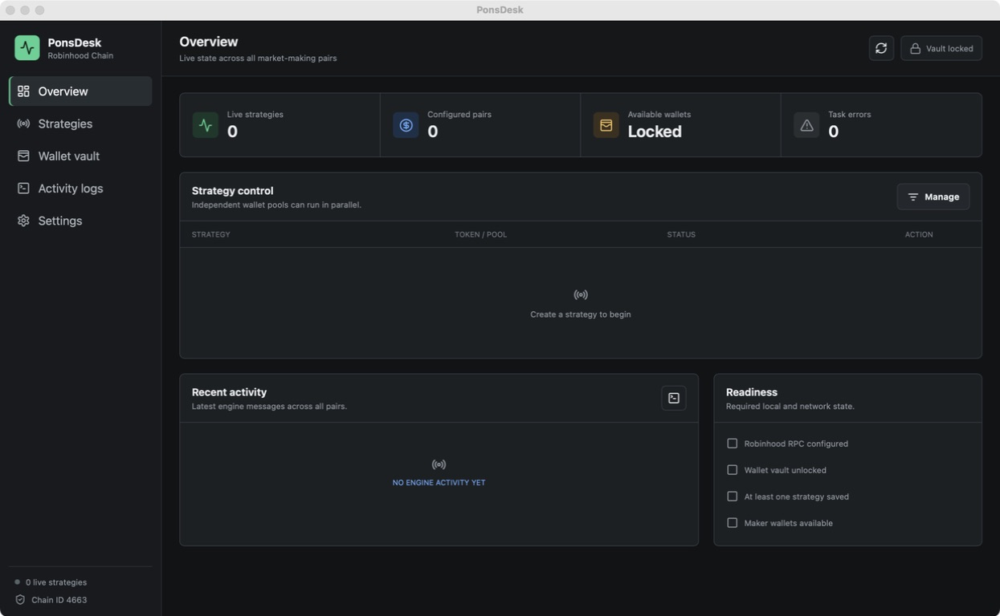

# PonsDesk

PonsDesk is a native desktop control plane for launching and operating Pons v1 and v2 market-making strategies on Robinhood Chain (chain ID `4663`). The trading and monitoring engine is written in Go; the desktop shell uses Wails and React.

> This application signs and broadcasts real transactions. Market making can lose all deployed capital through adverse price movement, gas, slippage, contract behavior, or software failure. Review every strategy and run a read-only preflight before enabling live execution.



## Highlights

- Run several token/pool strategies concurrently with independent RPC clients and logs.
- Prevent active strategies from sharing a wallet, avoiding cross-strategy nonce collisions.
- Launch a new Pons v2 bonding curve or a legacy Pons v1 token, and bind existing v2 curve or v1 Uniswap V3 venues.
- Configure token metadata, accumulation, distribution, slippage, gas reserve, and priority tip from the UI, with one-click prefill from the newest on-chain launch.
- Per-strategy statistics panel: buy/sell counts, ETH deployed, tokens sold, total costs (gas, tips, launch fee), and realized round profit.
- Reset a fully-exited launch strategy in one click to immediately test the next launch-and-trade round with the same configuration.
- Import newline-separated private keys or derive EVM accounts from a BIP-39 mnemonic at `m/44'/60'/0'/0/i`.
- Encrypt all imported keys locally with scrypt + AES-256-GCM. Mnemonics are never persisted.
- Generate secret-free GMGN bulk-import JSON for selected strategy wallets.
- Build desktop bundles for macOS and Windows through GitHub Actions.

## Downloads

Download the latest macOS universal application or Windows x64 installer from [GitHub Releases](https://github.com/bizipoopoo/pons-mm-desktop/releases).

When Apple signing credentials are configured, the release workflow signs macOS builds with a Developer ID Application certificate, notarizes them with Apple, and staples the ticket before packaging. Without those credentials, it publishes an unsigned macOS test build that may require approval under **System Settings > Privacy & Security** before its first launch.

## Donate

If PonsDesk is useful to you, you can support its continued open-source development with an EVM-wallet donation.

**EVM address:** `0xd439325794932c3ccd45affa85effe5363af1ca8`


The QR code contains only the address above. Use an EVM-compatible wallet and network, verify the full address before sending, and confirm that your selected network and token are supported. Blockchain transfers are generally irreversible.

## First Run

1. Open **Settings** and configure a Robinhood Chain RPC. A `wss://` endpoint enables event-driven pool monitoring; HTTPS falls back to polling.
2. Open **Wallet vault**, create a vault password, and import private keys or a mnemonic.
3. Create a strategy. The first assigned wallet is treasury/deployer; remaining wallets are makers.
4. Run **Preflight**. It performs RPC reads and launch/binding checks without sending a transaction.
5. Start the strategy and type `LIVE` in the explicit confirmation dialog.

After a successful launch, PonsDesk automatically persists the emitted token and venue address (v2 curve or v1 pool) and switches that strategy to **Existing pair**. Restarting the strategy will not launch a second token.

## Pons Protocol Versions

New strategies default to the current Pons v2 stack. Existing configurations created before v2 desktop support remain on v1 until explicitly changed.

| Protocol | Launch and trading path | Desktop behavior |
| --- | --- | --- |
| v2 | Bonding curve, then graduation to Uniswap V4 | Launches and market-makes the native-ETH curve; maker wallets are included as opening-tax exemptions. The engine stops safely at graduation and leaves any remaining positions for a future/manual V4 route. |
| v1 | Direct launch into a locked Uniswap V3 pool | Preserves the existing V3 market-making flow. Launching may require a whitelisted deployer while the v1 public gate is closed. |

A non-zero **Initial buy** routes the v2 launch through the official launch-and-buy router (`0xe33E…2948`), which executes the treasury's first buy inside the launch transaction itself — launch snipers cannot trade before it by construction, and the buy is exempt from the opening snipe tax. Maker wallets follow with a concurrent buy burst the moment the launch receipt lands. Custom ERC-20 quote curves are not supported by the desktop engine yet.

## Execution Cadence

Buy and sell rounds each offer four minimum-cadence presets: **Extreme** (100 ms), **Fast** (500 ms), **Slow** (1 second), and **Very slow** (1 minute). Chain confirmation can make the effective interval longer. New strategies default to Extreme concurrent buys across every funded maker wallet. Sells are concurrent by default and can be switched to sequential execution.

During accumulation each maker wallet buys exactly once per cycle: only funded wallets that currently hold zero tokens are eligible, so a wallet re-enters the rotation only after it has fully sold. Every detected retail buy immediately cancels maker buys that have not yet been broadcast and makes the decision from confirmed holdings and total cost. Total cost includes net ETH invested plus every fee paid so far: real gas (priority tips included) across launch, buys, sells, approvals, and WETH unwraps, plus the token launch fee. If the executable full-exit quote is above that total cost, the engine concurrently sells 100% of every strategy wallet's confirmed token balance in one shot. If it is not profitable, it fully clears wallets in batches of 4-6 per round. Any retail sell immediately stops scheduling later liquidation batches and returns the state to accumulation; a batch already broadcast is allowed to settle. If all our wallets are cleared before the retail position exits, the strategy stops. Already-broadcast buys remain tracked; when one confirms during an exit, its newly received tokens are immediately submitted for a residual sell. Sell approvals are prepared in advance for existing positions and broadcast immediately behind new buys to avoid a first-sell approval delay. All sells use 9999 bps (99.99%) slippage tolerance so concurrent batches are not rejected after earlier wallets move the curve; the configurable slippage field applies only to buys. If maker wallets have no spendable ETH, the strategy reports that it is waiting, refreshes balances every five seconds, and resumes automatically after a top-up.

For a newly launched token, the trade monitor subscribes first and then replays pool or curve logs beginning with the launch block. Live and replayed logs are deduplicated by transaction hash and log index, and 500 ms block-log polling continues as a fallback. This catches launch-block buys that land before the live subscription is ready and also covers HTTP-only RPC endpoints or temporary WebSocket gaps.

While a strategy is running, **One-click exit** stops normal strategy decisions and concurrently batch-sells 100% of the token balances held by the treasury and all maker wallets. It always forces concurrent liquidation regardless of the normal sell concurrency setting and requires typing `EXIT` in a dedicated confirmation dialog.

## Multi-Pair Safety

Each running strategy owns its own Pons client, context, engine, and selected wallet set. PonsDesk rejects a start request when any selected wallet is already reserved by another live strategy. Assign disjoint treasury and maker wallets to every concurrently active pair.

The vault must remain unlocked while strategies are running. Private keys are copied into in-memory signers only for selected strategies and are never written to a plaintext key file.

## GMGN Tags

GMGN does not currently expose an official write API for followed-wallet remarks. PonsDesk exports its supported bulk-import JSON through the download button in the strategy row. Import that file once from the GMGN website while logged into your chosen viewer account.

1. Unlock **Wallet vault** in PonsDesk.
2. Open **Strategies** and click **Export GMGN tags** on the strategy you want to export.
3. Save the generated `ponsdesk-gmgn-import.json` file.
4. Sign in to [GMGN wallet tracking](https://gmgn.ai/follow).
5. Click **批量导入导出** in the upper-right corner, then paste or import the generated JSON.
6. Review the wallet names and emoji, then confirm the import.

The exported file contains only public wallet addresses, names, and emoji. It never contains private keys or mnemonic phrases. GMGN supports importing up to 2,000 tracked addresses at a time. See the [official GMGN import guide](https://docs.gmgn.ai/cn/dao-ru-dao-chu-guan-zhu-qian-bao) for the current website workflow.

## Development

Requirements:

- Go `1.25+`
- Node.js `22+`
- Wails CLI `v2.14.0`
- Platform dependencies listed in the [Wails installation guide](https://wails.io/docs/gettingstarted/installation)

```bash
go install github.com/wailsapp/wails/v2/cmd/wails@v2.14.0
cd frontend && npm ci && cd ..
wails dev
```

Run all checks:

```bash
go test ./...
go vet ./...
npm --prefix frontend run build
wails build -clean -trimpath
```

Application data is stored outside the repository:

| Platform | Default directory |
| --- | --- |
| macOS | `~/Library/Application Support/PonsDesk` |
| Windows | `%AppData%\PonsDesk` |

`config.json` contains non-wallet strategy configuration and wallet IDs. `wallets.vault` contains the encrypted wallet payload. Back up the recovery phrase and vault password separately; PonsDesk cannot recover either.

## Releases

Every version tag automatically builds macOS universal and Windows x64 desktop artifacts and publishes a GitHub Release:

```bash
git tag v0.1.0
git push origin v0.1.0
```

When all of the following GitHub Actions repository secrets are configured, the macOS release job signs and notarizes the application. If any credential is missing, the workflow skips signing and publishes an unsigned test build instead:

| Secret | Value |
| --- | --- |
| `APPLE_CERTIFICATE_BASE64` | Base64-encoded Developer ID Application `.p12` export |
| `APPLE_CERTIFICATE_PASSWORD` | Password used when exporting the `.p12` file |
| `APPLE_ID` | Apple ID used for notarization |
| `APPLE_APP_SPECIFIC_PASSWORD` | App-specific password for that Apple ID |
| `APPLE_TEAM_ID` | 10-character Apple Developer team ID |

Generate the certificate secret on macOS with `base64 -i DeveloperIDApplication.p12 | pbcopy`. Keep the certificate and all credentials out of the repository.

Pushes and pull requests to `main` run Go tests, `go vet`, the frontend production build, and secret scanning.

## Architecture

```text
React UI <-> Wails bindings <-> control.Service
                                |-- encrypted vault
                                |-- persistent strategy store
                                `-- concurrent strategy jobs
                                      |-- ponsmm.Engine
                                      `-- pons.Client
```

The original protocol bindings and engine live in `internal/pons` and `internal/ponsmm`. Desktop orchestration lives in `internal/control`; key encryption and mnemonic derivation live in `internal/vault`.

## Security

- Never paste real private keys into issues, logs, screenshots, or repository files.
- Do not place funds in a GMGN viewer wallet.
- Use a dedicated RPC key and rotate it if an endpoint is accidentally committed.
- Validate downloaded release checksums and repository provenance.
- Report vulnerabilities privately according to [SECURITY.md](SECURITY.md).

## License

[MIT](LICENSE)
